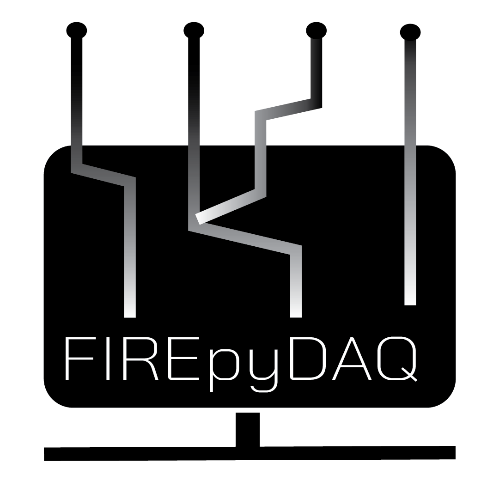

<p align="center">
  
</p> 

<div align="center">

<!-- Releases -->


<!-- Workflows -->
[](https://github.com/ulfsri/firepydaq/actions/workflows/RunPytest.yml)
[](https://github.com/ulfsri/firepydaq/actions/workflows/MakeExe.yml)

<!-- Followers and usage -->
[](https://github.com/ulfsri/firepydaq/network/members?style=flat-square)
[](https://github.com/ulfsri/firepydaq/stargazers?style=flat-square)


</div>

# firepydaq

FIREpyDAQ is a python based Facilitated Interface for Recording Experiments (FIRE), for devices that are traditionally used for data acquisition. The device list and general requirements are given below.

## Installation

Using `pip`, you can install this package. `pip` will also install relevant dependencies.

```bash
$ pip install firepydaq
```
## Hardware/Communication Requirements

This interface can be used for three types of devices simultaneously,

- NI hardware, which requires installation of <a href="https://www.ni.com/en/support/downloads/drivers/download.ni-daq-mx.html#532710" target="_blank">NI-DAQmx driver</a> from National Instruments.
	- This has been built so far only for Analog Input and Output data.
- Alicat Mass Flow Controllers and Mass Flow Meter, which is based via serial communication and python API available from <a href="https://github.com/numat/alicat" target="_blank">Alicat</a>.
- Thorlabs CLD101X, which is based on serial communication

## Usage

`firepydaq` can be used to compile PyQT based user interface.

```python
# On Windows: Protect your script from importing child processes
# Required if you need dashboard access.
# Dashboard is spawned as a separate process. 
if __name__ == "__main__":
    from firepydaq.FIREpyDAQ_Acquisition import FIREpyDAQ_Acquisition
    FIREpyDAQ_Acquisition()

```

Alternatively, you can run the following.
 
```python
# On Windows: Protect your script from importing child processes 
# Required if you need dashboard access.
# Dashboard is spawned as a separate process. 
if __name__ == "__main__":
	import multiprocessing as mp
	mp.freeze_support()
	from firepydaq.acquisition.acquisition import application
	import sys
	from PySide6.QTWidgets import QApplication

	app = QApplication(sys.argv)
	main_app = application()
	main_app.show()
	sys.exit(app.exec())
```

## Contributing

Interested in contributing? Check out the [contributing guidelines](docs/contributing.md). 
Please note that this project is released with a Code of Conduct. 
By contributing to this project, you agree to abide by its terms.

Suggested procedure is given below. Note: Pull request into the `main` branch will not be accepted.

- Fork this repository.
- Create a `your_feature` branch from the `dev` branch. 
- Clone your repository on your machine.
- Install poetry using `pipx` as recommended or using `pip`, and `make` (optional). 
- If you install and configure `make` - run `make build`, which will initiate the commands `poetry build`, `poetry lock`, and `poetry install` in succession. This will create a virtual environment for testing your developments.
- Alternatively (without `make`), you can run individual `poetry` commands to install the package on a virtual environment (ideal) for local development.
- Make your edits, and send a PR following the template. 

## License

`firepydaq` was created by Dushyant M. Chaudhari. It is licensed under the terms
of the GNU General Public license, v.3.0.

## Acknowledgements

Thanks to the following community guidelines which were immensely helpful while making this package.

- <a href="https://py-pkgs.org/welcome" target="_blank">py-pkgs</a>
- <a href="https://coderefinery.github.io/documentation/" target="_blank">Code refinery documentation</a>
- <a href="https://www.sphinx-doc.org/en/master/usage/index.html" target="_blank">Sphinx documentation</a>
- <a href="https://sphinx-autoapi.readthedocs.io/en/latest/" target="_blank">Sphinx AutoAPI documentation</a>
- <a href="https://numpydoc.readthedocs.io/en/latest/format.html" target="_blank">Numpy docstrings style guide</a>


