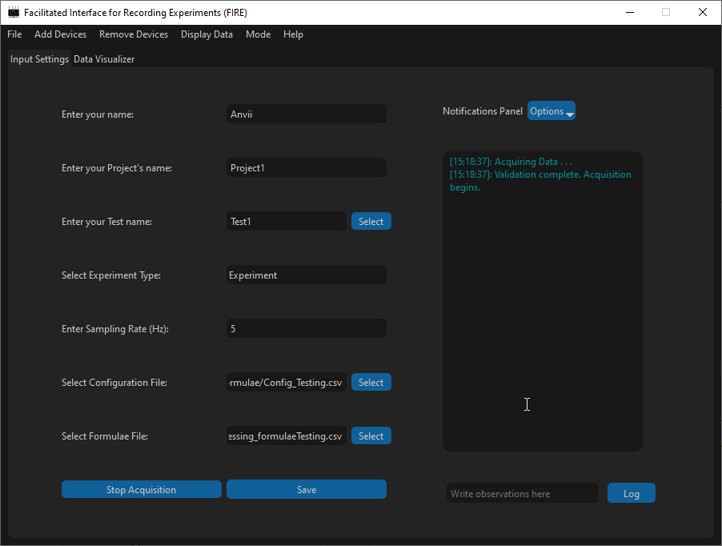
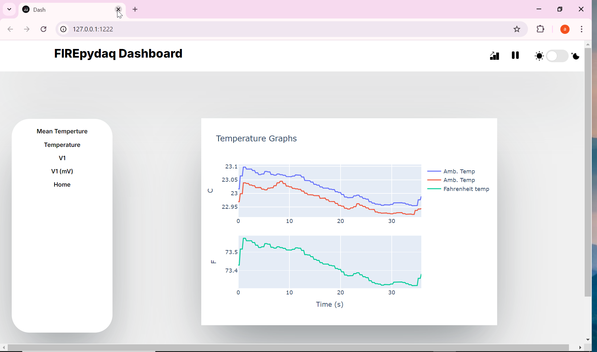

FIREpyDAQ is a python based Facilitated Interface for Recording Experiments (FIRE), for devices that are traditionally used for data acquisition. The device list and general requirements are given below.

## Installation

Using `pip`, you can install this package. `pip` will also install relevant dependencies.

```bash
$ pip install firepydaq
```
## Hardware/Communication Requirements

This interface can be used for three types of devices simultaneously,

- NI hardware, which requires installation of <a href="https://www.ni.com/en/support/downloads/drivers/download.ni-daq-mx.html#532710" target="_blank">NI-DAQmx driver</a> from National Instruments.
  - This has been built so far only for Analog Input and Output data.
- Alicat Mass Flow Controllers and Mass Flow Meter, which is based via serial communication and python API available from <a href="https://github.com/numat/alicat" target="_blank">Numat</a>.
- Thorlabs CLD101X, which is based on serial communication


## Architecture

```{image} assets/FIREpyDAQArchitecture.svg
```
## Usage

`firepydaq` can be compiled by using one of the following scripts. A video showing the usage is provided on [Github](https://github.com/ulfsri/firepydaq).

```python
# On Windows: Protect your script from importing child processes
# Required if you need dashboard access.
# Dashboard is spawned as a separate process. 
if __name__ == "__main__":
    from firepydaq.FIREpyDAQ_Acquisition import FIREpyDAQ_Acquisition
    FIREpyDAQ_Acquisition()

```

Alternatively, you can run the following.
 
```python
# On Windows: Protect your script from importing child processes 
# Required if you need dashboard access.
# Dashboard is spawned as a separate process. 
if __name__ == "__main__":
  import multiprocessing as mp
  mp.freeze_support()
  from firepydaq.acquisition.acquisition import application
  import sys
  from PySide6.QTWidgets import QApplication

  app = QApplication(sys.argv)
  main_app = application()
  main_app.show()
  sys.exit(app.exec())
```

Example of Acquisition interface during acquisition:


Example of how the dashboard looks like during acquisition:


## Citation
Full citation:
```{note}

Chaudhari, D. M., Mishra, A., (2024). Facilitated interface for recording experiments - a python-based data acquisition program. In Github Repository. Fire Safety Research Institute, UL Research Institutes; Github. https://github.com/ulfsri/firepydaq

```

Bib:
```
@misc{firepydaq,
title={Facilitated Interface for Recording Experiments - A python-package for data acquisition.},
howpublished = {Fire Safety Research Institute, UL Research Institutes},
url = {https://github.com/ulfsri/firepydaq},
author = {Dushyant M. Chaudhari, Anvii Mishra},
publisher = {Github},
journal = {Github Repository},
year = {2024}
}
```
