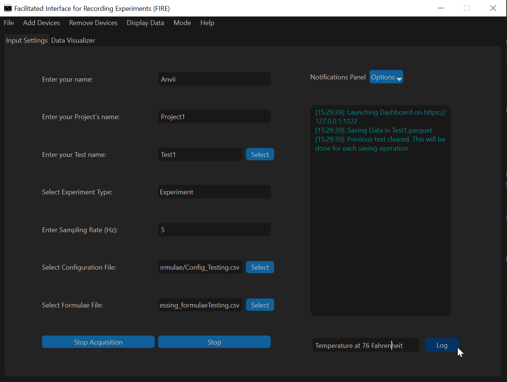
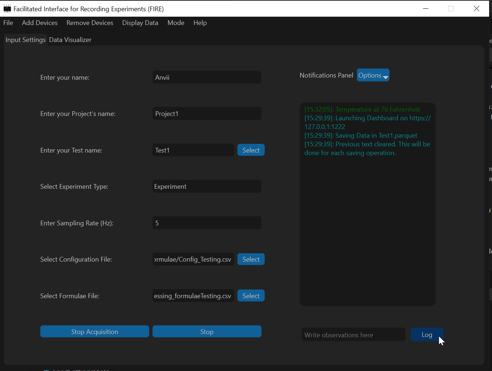

(GUI)=
# Acquisition Application

This is an example of how to use the acquisition application to collect data from the NI system and added devices and visualize it for each channel and using a dashboard.

## 1. Setting Up the Application

To run the application, paste the following lines of code in an empty python file: 

```
if __name__ == "__main__":
    from firepydaq.FIREpyDAQ_Acquisition import FIREpyDAQ_Acquisition
    FIREpyDAQ_Acquisition()
```

On running the file, the application window would appear. 
```{image} assets/Acquisition/SetUp1.png
:width: 700px
:align: center
:alt: AcuisitionGUI
```
<br></br>

## 2. Acquisition Settings 

To configure acquisition settings, the following are mandatory fields.

- `Name`: Alphanumeric string without spaces. Only underscore is accepted as a valid special character.
- `Project Name`: Alphanumeric string without spaces. Only underscore is accepted as a valid special character.
- `Test Name`: Either a string or a file path. 
    If this is a string, only alphanumeric string without spaces are accepted. Only underscore is accepted as a valid special character.
- `Sampling Rate`: Must be a float >= 1Hz and compatible with the connected NI device. 
- `Experiment Type`: `Experiment` or `Calibration`.
- `Configuration File`: A `.csv` file (see [here](#NIConfigExample) for more info)

Optionally, you can select the Formulae File (refer [here](#FormulaeExample) for more info). 

```{image} assets/Acquisition/SetUp2.png
:width: 700px
:align: center
:alt: AcqFilled
```
<br></br>

## 3. Additional Settings

The menu bar presents some extra functionalities as discussed below. All main menu settings have keyboard shortcuts listed on the main menu itself for reference.

### Display Modes 
To toggle between display modes (light and dark), select the `Mode` in the main menu and select your desired settings as shown below.

```{image} assets/Acquisition/Setting1.png
:width: 700px
:align: center
:alt: AcqModes
```

### Dashboard and Tab Display
In order to visualize the saved data collected, select the desired data display option from the `Display Data` Menu. 
- `Display in a Tab` spins out a tab with graphs for each channel when the Begin Acquisition button is enabled.
- `Display in a Dashboard` option spins out a dashboard on a web browser when the Save Button is enabled. 
- `Display All` enables both tab and dashboard to spin out. 
- `No Display (Default)` allows data collection without any visualization. 

```{image} assets/Acquisition/4.png
:width: 500px
:align: center
:alt: AcqDislpayOpts
```

### Loading and Saving DAQ Configuration
The Options under the File Menu enables loading settings from a `.json` file (refer to Example: JSON File **todo**) to repeat data acquisition under similar conditions. The `File` Menu also presents the option to Save Settings to a `.json` file enabling a user to save configuration settings to refer to later.

In order to Save Settings, click on `Save DAQ Configuration` under the `File` menu. 
```{image} assets/Acquisition/5.png
:width: 700px
:align: center
:alt: SaveMenuButton
```

In the dialog box that appears, specify the desired name and directory of the file to save to. Finally, click on `Done` to save settings to the selected file path.

```{image} assets/Acquisition/6.png
:width: 150px
:align: center
:alt: SaveSet
```

In order to Load Settings, click on `Load DAQ Configuration` under the File Menu. 
```{image} assets/Acquisition/7.png
:width: 400px
:align: center
:alt: LoadMenuButton
```

In the dialog box that appears, select the file to load data from. 
```{image} assets/Acquisition/8.png
:width: 150px
:align: center
:alt: LoadSet
```

Finally, click on `Done` to load settings from the select file. After loading, desired settings can still be changed.

### Help
For more information and concerns about the application, visit the `Help menu` to raise an issue on our GitHub page or visit this documentation for difficulties with usage.

## 4. Acquisition and Saving

After configuring the desired settings, click on `Begin Acquisition` to establish connection with the NI System or other added devices and create AO/AI tasks. The notifications panel will indicate if the acquisition process has begun or run into any faults. 

```{image} assets/Acquisition/10.png
:width: 700px
:align: center
:alt: AcqSave
```

**todo: change this image to show save paths for these two types**

Once acquisition begins safely, the `Save Button` is enabled and on clicking it, the data collected is saved. There are two ways in which the file path where the data is saved is created, 

- In the case, a Test Name is provided as a string, the acquired data will be saved in a directory with the name of the chosen `Experiment Type` in the current working directory with the filename in the format `[YYYYMMDD]_[HHMMSS]_[ProjectName]_[TestName]_` with the extensions `.parquet` and `.json` for data and settings file respectively. 
- If a file path is specified in the Test Name entry, the data would be saved at the file path specified with the extensions `.parquet` and `.json` for data and settings file respectively. If a parquet file already exists in the path specified, a number `XX` will be appended to the provided filename. 
- Additional device data (currently only MFCs), will be collected and saved once every second in the same directory as the data file, but in a `.csv` extension. The filename will be appended with the MFC device name (Example, `_MyMFC`) for reference.


```{note}
Collected Data are always saved every second. This is done so that the data loss during the saving operation can only occur if the saving operation takes longer than 1 s (which should rarely be the case).

**If larger number of channels are prescribed, the acquisition may run into memory issues.**
```

```{hint}
For reference, 100 channel acquisition (50 thermocouples, 50 voltages) at 5 Hz on a PXIe-1088 device (8 GB RAM, 2.64 GHz processor) runs into memory issues after about one hour of continuous acquisition and saving. 
```

### Data visualizer
In the case 'Display Tab or All' is selected, the 'Data Visualizer' Tab in the program is populated. This tab allows user to see only raw data during acquisition. A drop-down in this tab contains all labels used for the NI setup for the user to select and see that channel's raw output.

```{image} assets/Acquisition/14.png
:width: 700px
:align: center
:alt: DataViz
```

<br></br>
```{note}
Although the time to update these plots is usually less than 10ms, it is strongly advised to use the data visualizer to **debug acquisition setup** and NOT during the saving process of the collected data. 

This will ensure minimal data loss potential in case plotting takes longer time for larger amount of data. 
```

(AcqDashboard)=
### Dashboard

The Dashboard is also spawned out as a separate parallel process if `Display Dashboard` or `Display All` is chosen as a display mode. 

In the case a formula file was selected for the visualizations on the dashboard, a file with `\_PostProcessed` appended to the parquet file's name is created in the same directory as the parquet file. This file stores the post-processed data used to plot the graphs in the dashboard.

For more information on how to navigate through the dashboard, check out [Dashboard Section](Dashboard). 


```{image} assets/Acquisition/11.png
:width: 700px
:align: center
:alt: DashboardSpwanMsg
```
<br></br>
```{image} assets/Acquisition/12.png
:width: 700px
:align: center
:alt: DashboardExample
```
<br></br>

## 5. Logger

The application uses a logging system to track any updates or unexpected errors that may occur in the middle of acquisition or saving. Major milestones during the process of acquisition and saving are logged in a file `FirePyDAQ.log` created in the directory the code is run from. Although similar to notifications, the logger offers more detailed insight into the application. 

The logging system is renewed every time a new instance of the application is opened and this log file is over-written. 

## 6. Notifications Panel
Additionally, the notifications panel allows you to gain insights into the data acquisition process and if specific steps during the saving and/or acquisition process are successfully completed or run into issues. Observations may be added by logging data into the line-edit below and clicking on the `Log` Button. The text in the notifications panel is colored based on the type of messages:

|   Message Type     | Color |
|   --------  | -------    |
|   Warning   | Orange     |
|   Error     | Red        |
|   Success   | Green      |
|   Default   | Grey       |
| Observation | Darkgreen  |
|    Info     | Cyan       |

Finally, the notifications panel has an `Options` Menu that allows users to either `Clear` or `Save` their notifications. On pressing `Clear`, all previous notifications are wiped out. On clicking `Save`, all notifications are saved into the chosen directory.

|Log observation text |  Logged observation display|
|:-------------------------:|:-------------------------:|
|  |  |

```{note}
Written observation is appended with time-stamp when the "Log" button is clicked. 

This will be changed in the future to improve time-tracking of observations by having multiple pop-up dialog boxes when log button is clicked and logging the exact time for observations.
```
## 7. Experiment Data and Exiting the Application

Experimental data can be retrieved with the file paths explained above, (see Acquisition and Saving). The correct chronology to exit the application is as follows: stopping Saving; stopping acquisition and finally exiting the application in order to terminate connection with the Dashboard and Hardware Systems safely.